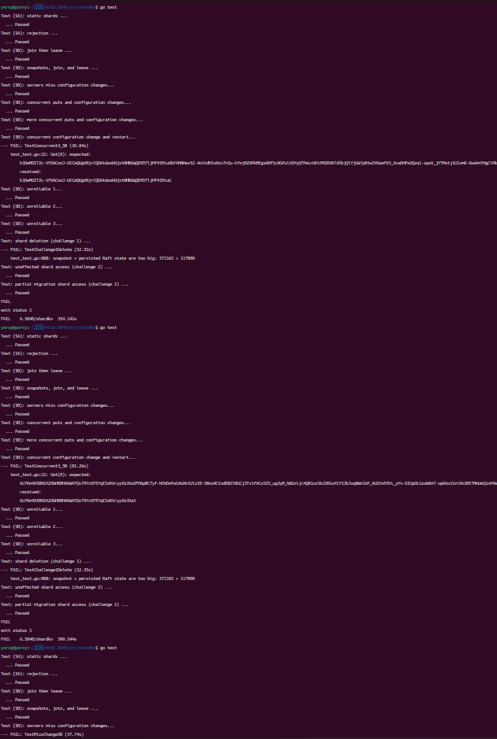

# 2024-mit6.5840
- pass lab1,lab2,lab3,lab4(余1),lab5(余1)，chllange(余1)

其中lab3和lab4的部分测试仍有比较不低的概率不能通过（20%吧？lab3的figure8，lab4的多客户端分区恢复）。。

## 遇到的问题和解决方案：
死锁问题

由于：

	Raft持有锁 -> 尝试发送消息到applyCh -> KVServer尝试处理消息并获取锁 -> KVServer等待Raft释放锁 -> Raft等待消息被接收

所以要在在锁外发送消息

 在lab4A中，对于kvserver重启后进行恢复的机制(日志重放，也就是将快照之后到raft的lastApplied之间的日志内容再应用一遍)，但在运行测试的时候仍然遇到这样的问题：168 yx 0 202 y之间的日志全部丢失了，

    2025/03/24 17:33:00 [服务器 0] 键0更新: 新值=x 0 0 yx 0 1 yx 0 2 yx 0 3 yx 0 4 yx 0 5 yx 0 6 yx 0 7 yx 0 8 yx 0 9 yx 0 10 yx 0 11 yx 0 12 yx 0 13 yx 0 14 yx 0 15 yx 0 16 yx 0 17 yx 0 18 yx 0 19 yx 0 20 yx 0 21 y
    x 0 22 yx 0 23 yx 0 24 yx 0 25 yx 0 26 yx 0 27 yx 0 28 yx 0 29 yx 0 30 yx 0 31 yx 0 32 yx 0 33 yx 0 34 yx 0 35 yx 0 36 yx 0 37 yx 0 38 yx 0 39 yx 0 40 yx 0 41 yx 0 42 yx 0 43 yx 0 44 yx 0 45 yx 0 46 yx 0 47 yx 0
    48 yx 0 49 yx 0 50 yx 0 51 yx 0 52 yx 0 53 yx 0 54 yx 0 55 yx 0 56 yx 0 57 yx 0 58 yx 0 59 yx 0 60 yx 0 61 yx 0 62 yx 0 63 yx 0 64 yx 0 65 yx 0 66 yx 0 67 yx 0 68 yx 0 69 yx 0 70 yx 0 71 yx 0 72 yx 0 73 yx 0 74
    yx 0 75 yx 0 76 yx 0 77 yx 0 78 yx 0 79 yx 0 80 yx 0 81 yx 0 82 yx 0 83 yx 0 84 yx 0 85 yx 0 86 yx 0 87 yx 0 88 yx 0 89 yx 0 90 yx 0 91 yx 0 92 yx 0 93 yx 0 94 yx 0 95 yx 0 96 yx 0 97 yx 0 98 yx 0 99 yx 0 100 y
    x 0 101 yx 0 102 yx 0 103 yx 0 104 yx 0 105 yx 0 106 yx 0 107 yx 0 108 yx 0 109 yx 0 110 yx 0 111 yx 0 112 yx 0 113 yx 0 114 yx 0 115 yx 0 116 yx 0 117 yx 0 118 yx 0 119 yx 0 120 yx 0 121 yx 0 122 yx 0 123 yx 0 
    124 yx 0 125 yx 0 126 yx 0 127 yx 0 128 yx 0 129 yx 0 130 yx 0 131 yx 0 132 yx 0 133 yx 0 134 yx 0 135 yx 0 136 yx 0 137 yx 0 138 yx 0 139 yx 0 140 yx 0 141 yx 0 142 yx 0 143 yx 0 144 yx 0 145 yx 0 146 yx 0 147 
    yx 0 148 yx 0 149 yx 0 150 yx 0 151 yx 0 152 yx 0 153 yx 0 154 yx 0 155 yx 0 156 yx 0 157 yx 0 158 yx 0 159 yx 0 160 yx 0 161 yx 0 162 yx 0 163 yx 0 164 yx 0 165 yx 0 166 yx 0 167 yx 0 168 yx 0 169 yx 0 170 yx 0
    171 yx 0 172 yx 0 173 yx 0 174 yx 0 175 yx 0 176 yx 0 177 yx 0 178 yx 0 179 yx 0 180 yx 0 181 yx 0 182 yx 0 183 yx 0 184 yx 0 185 yx 0 186 yx 0 187 yx 0 188 yx 0 189 yx 0 190 yx 0 191 yx 0 192 yx 0 193 yx 0 194
    yx 0 195 yx 0 196 yx 0 197 yx 0 198 yx 0 199 yx 0 200 yx 0 201 yx 0 202 y, 索引=1308
    2025/03/24 17:33:00 [服务器 0] 检测到重复命令: 客户端ID=2248126934068928055, 序列号=434, 最后序列号=434
    2025/03/24 17:33:00 [服务器 1] 执行Get: 键=0, 当前值=x 0 0 yx 0 1 yx 0 2 yx 0 3 yx 0 4 yx 0 5 yx 0 6 yx 0 7 yx 0 8 yx 0 9 yx 0 10 yx 0 11 yx 0 12 yx 0 13 yx 0 14 yx 0 15 yx 0 16 yx 0 17 yx 0 18 yx 0 19 yx 0 20 y
    x 0 21 yx 0 22 yx 0 23 yx 0 24 yx 0 25 yx 0 26 yx 0 27 yx 0 28 yx 0 29 yx 0 30 yx 0 31 yx 0 32 yx 0 33 yx 0 34 yx 0 35 yx 0 36 yx 0 37 yx 0 38 yx 0 39 yx 0 40 yx 0 41 yx 0 42 yx 0 43 yx 0 44 yx 0 45 yx 0 46 yx 0
    47 yx 0 48 yx 0 49 yx 0 50 yx 0 51 yx 0 52 yx 0 53 yx 0 54 yx 0 55 yx 0 56 yx 0 57 yx 0 58 yx 0 59 yx 0 60 yx 0 61 yx 0 62 yx 0 63 yx 0 64 yx 0 65 yx 0 66 yx 0 67 yx 0 68 yx 0 69 yx 0 70 yx 0 71 yx 0 72 yx 0 73
    yx 0 74 yx 0 75 yx 0 76 yx 0 77 yx 0 78 yx 0 79 yx 0 80 yx 0 81 yx 0 82 yx 0 83 yx 0 84 yx 0 85 yx 0 86 yx 0 87 yx 0 88 yx 0 89 yx 0 90 yx 0 91 yx 0 92 yx 0 93 yx 0 94 yx 0 95 yx 0 96 yx 0 97 yx 0 98 yx 0 99 yx
    0 100 yx 0 101 yx 0 102 yx 0 103 yx 0 104 yx 0 105 yx 0 106 yx 0 107 yx 0 108 yx 0 109 yx 0 110 yx 0 111 yx 0 112 yx 0 113 yx 0 114 yx 0 115 yx 0 116 yx 0 117 yx 0 118 yx 0 119 yx 0 120 yx 0 121 yx 0 122 yx 0 1
    23 yx 0 124 yx 0 125 yx 0 126 yx 0 127 yx 0 128 yx 0 129 yx 0 130 yx 0 131 yx 0 132 yx 0 133 yx 0 134 yx 0 135 yx 0 136 yx 0 137 yx 0 138 yx 0 139 yx 0 140 yx 0 141 yx 0 142 yx 0 143 yx 0 144 yx 0 145 yx 0 146 $
    x 0 147 yx 0 148 yx 0 149 yx 0 150 yx 0 151 yx 0 152 yx 0 153 yx 0 154 yx 0 155 yx 0 156 yx 0 157 yx 0 158 yx 0 159 yx 0 160 yx 0 161 yx 0 162 yx 0 163 yx 0 164 yx 0 165 yx 0 166 yx 0 167 yx 0 168 yx 0 202 y
    2025/03/24 17:33:00 [服务器 1] 通知索引=1310的等待客户端
        --test_test.go:144: 0 missing element x 0 169 y in Append result-- x 0 0 yx 0 1 yx 0 2 yx 0 3 yx 0 4 yx 0 5 yx 0 6 yx 0 7 yx 0 8 yx 0 9 yx 0 10 yx 0 11 yx 0 12 yx 0 13 yx 0 14 yx 0 15 yx 0 16 yx 0 17 yx 0 18 yx 
    0 19 yx 0 20 yx 0 21 yx 0 22 yx 0 23 yx 0 24 yx 0 25 yx 0 26 yx 0 27 yx 0 28 yx 0 29 yx 0 30 yx 0 31 yx 0 32 yx 0 33 yx 0 34 yx 0 35 yx 0 36 yx 0 37 yx 0 38 yx 0 39 yx 0 40 yx 0 41 yx 0 42 yx 0 43 yx 0 44 yx 0 4
    5 yx 0 46 yx 0 47 yx 0 48 yx 0 49 yx 0 50 yx 0 51 yx 0 52 yx 0 53 yx 0 54 yx 0 55 yx 0 56 yx 0 57 yx 0 58 yx 0 59 yx 0 60 yx 0 61 yx 0 62 yx 0 63 yx 0 64 yx 0 65 yx 0 66 yx 0 67 yx 0 68 yx 0 69 yx 0 70 yx 0 71 y
    x 0 72 yx 0 73 yx 0 74 yx 0 75 yx 0 76 yx 0 77 yx 0 78 yx 0 79 yx 0 80 yx 0 81 yx 0 82 yx 0 83 yx 0 84 yx 0 85 yx 0 86 yx 0 87 yx 0 88 yx 0 89 yx 0 90 yx 0 91 yx 0 92 yx 0 93 yx 0 94 yx 0 95 yx 0 96 yx 0 97 yx 0
    98 yx 0 99 yx 0 100 yx 0 101 yx 0 102 yx 0 103 yx 0 104 yx 0 105 yx 0 106 yx 0 107 yx 0 108 yx 0 109 yx 0 110 yx 0 111 yx 0 112 yx 0 113 yx 0 114 yx 0 115 yx 0 116 yx 0 117 yx 0 118 yx 0 119 yx 0 120 yx 0 121 y
    x 0 122 yx 0 123 yx 0 124 yx 0 125 yx 0 126 yx 0 127 yx 0 128 yx 0 129 yx 0 130 yx 0 131 yx 0 132 yx 0 133 yx 0 134 yx 0 135 yx 0 136 yx 0 137 yx 0 138 yx 0 139 yx 0 140 yx 0 141 yx 0 142 yx 0 143 yx 0 144 yx 0 
    145 yx 0 146 yx 0 147 yx 0 148 yx 0 149 yx 0 150 yx 0 151 yx 0 152 yx 0 153 yx 0 154 yx 0 155 yx 0 156 yx 0 157 yx 0 158 yx 0 159 yx 0 160 yx 0 161 yx 0 162 yx 0 163 yx 0 164 yx 0 165 yx 0 166 yx 0 167 yx 0 168 
    yx 0 202 y

一开始以为是raft的问题，日志丢失了。后来经过调试：

    124 yx 0 125 yx 0 126 yx 0 127 yx 0 128 yx 0 129 yx 0 130 yx 0 131 yx 0 132 yx 0 133 yx 0 134 yx 0 135 yx 0 136 yx 0 137 yx 0 138 yx 0 139 yx 0 140 yx 0 141 yx 0 142 yx 0 143 yx 0 144 yx 0 145 yx 0 146 yx 0 147 
    yx 0 148 yx 0 149 yx 0 150 yx 0 151 yx 0 152 yx 0 153 yx 0 154 yx 0 155 yx 0 156 yx 0 157 yx 0 158 yx 0 159 yx 0 160 yx 0 161 yx 0 162 yx 0 163 yx 0 164 yx 0 165 yx 0 166 yx 0 167 yx 0 168 yx 0 169 yx 0 170 yx 0
    171 yx 0 172 yx 0 173 yx 0 174 yx 0 175 yx 0 176 yx 0 177 yx 0 178 yx 0 179 yx 0 180 yx 0 181 yx 0 182 yx 0 183 yx 0 184 yx 0 185 yx 0 186 yx 0 187 yx 0 188 yx 0 189 yx 0 190 yx 0 191 yx 0 202 y, 索引=1308     
    2025/03/24 17:33:00 [服务器 2] 检测到重复命令: 客户端ID=2248126934068928055, 序列号=434, 最后序列号=434
    2025/03/24 17:33:00 [Raft 2] 重放日志: 索引=1291
    2025/03/24 17:33:00 [Raft 2] 重放日志: 索引=1292
    2025/03/24 17:33:00 [服务器 2] 忽略过期命令: 索引=1291, 最后应用=1309
    2025/03/24 17:33:00 [服务器 2] 忽略过期命令: 索引=1292, 最后应用=1309
    2025/03/24 17:33:00 [Raft 2] 重放日志: 索引=1293
    2025/03/24 17:33:00 [Raft 2] 重放日志: 索引=1294
    2025/03/24 17:33:00 [服务器 2] 忽略过期命令: 索引=1293, 最后应用=1309
    2025/03/24 17:33:00 [服务器 2] 忽略过期命令: 索引=1294, 最后应用=1309
    2025/03/24 17:33:00 [Raft 2] 重放日志: 索引=1295
    2025/03/24 17:33:00 [Raft 2] 重放日志: 索引=1296
    2025/03/24 17:33:00 [服务器 2] 忽略过期命令: 索引=1295, 最后应用=1309
    2025/03/24 17:33:00 [服务器 2] 忽略过期命令: 索引=1296, 最后应用=1309
    2025/03/24 17:33:00 [Raft 2] 重放日志: 索引=1297
    2025/03/24 17:33:00 [Raft 2] 重放日志: 索引=1298                          

发现是恢复机制存在问题：在系统恢复（日志重放）阶段，当服务器正在从快照进行恢复并重放日志时，新的Append请求仍然被接受处理，导致数据状态出现不一致。

通过：   

	isRecoveryRequest = int64(args.RequestID) <= int64(kv.lastApplied) ||
	         kv.initialClients[args.ClientID] ||
	            args.Op == AppendOp

和：

		// 只允许特定类型的请求通过
		if !isRecoveryRequest {
			DPrintf("[服务器 %d] 拒绝请求，日志重放尚未完成: Op=%s, ClientID=%d, RequestID=%d",
				kv.me, args.Op, args.ClientID, args.RequestID)
			reply.Err = ErrWrongLeader // 使用ErrWrongLeader作为恢复中的错误码
			kv.mu.Unlock()
			return
		}

修复了日志重放的功能

### lab5的问题
做到这发现raft的commitIndex没有持久化到persist里面，加入这个之后lab4的TestPersistConcurrent4A居然就过不了了，之后再修吧。

    // 如果endIndex为-1，则重放到最新的已提交日志
    func (rf *Raft) RequestLogReplay(startIndex int, endIndex int) {
        rf.mu.Lock()

        validStartIndex := max(startIndex, rf.lastIncludedIndex+1)

        validEndIndex := rf.commitIndex
        if endIndex != -1 {
            validEndIndex = min(endIndex, rf.commitIndex)
        }

        if validStartIndex > validEndIndex {
            rf.mu.Unlock()
            return
        }
        ...}

数据迁移过程中的一致性问题（TestJoinLeave5B测试失败：）：

问题原因：分片从Group 100迁移到Group 101的过程中，Group 100继续接收了对该分片的写入请求(APPEND key 4 += gKRDi)，但这个更新没有被迁移到Group 101，导致数据不一致。

实现了两阶段分片迁移机制，通过分片状态管理确保数据一致性：
添加分片状态跟踪：

    const (
     ShardNormal    = 0 // 正常状态
     ShardMigrating = 1 // 迁移中状态
     ShardWaiting   = 2 // 等待接收状态
    )
配置更新时标记分片状态：

    离开组的分片标记为ShardMigrating
    等待接收的分片标记为ShardWaiting
    保持的分片标记为ShardNormal
拒绝对非正常状态分片的请求：

    if kv.shardStates[shard] == ShardMigrating || kv.shardStates[shard] == ShardWaiting {
     reply.Err = ErrWrongGroup
     return
   }
分片迁移完成后通知源组清理：
目标组成功安装分片后，向源组发送清理请求，源组确认清理后才重置分片状态。
将分片状态包含在快照中，确保崩溃恢复后状态一致

还有好多来着，边问ai边改，改着改着就忘了

## 还未解决的

- Test: shard deletion (challenge 1) ...

        Test: shard deletion (challenge 1) ...
        --- FAIL: TestChallenge1Delete (52.32s)
            test_test.go:888: snapshot + persisted Raft state are too big: 371162 > 117000
感觉是和redis那个日志重写一样吧，就是删掉被覆盖掉的操作之类的，以后再试试

- TestConcurrent3_5B

        Test (5B): concurrent configuration change and restart...
            ... Passed
        --- FAIL: TestConcurrent3_5B (176.49s)
        config.go:81: test took longer than 120 seconds
然后用-race测试发现有竞争，下次写的时候再改吧。

- 还有个上面提到的lab4的TestPersistConcurrent4A
